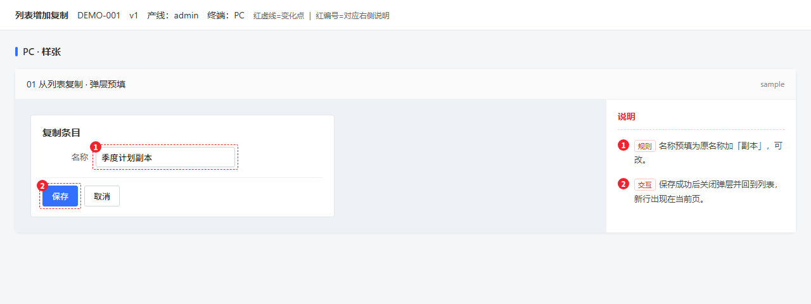

# Prototype Design

给产品和 Agent 用的高保真 HTML 原型技能：按阶段画页面，改动用红虚线圈出来，说明固定在右侧，每一步等人看过再往下走。

Cursor、Claude Code、Codex、ZCode、OpenCode、WorkBuddy 等能加载 `SKILL.md` 的 Agent 都可以用。

## 画出来是这样

下面是仓库里的小样例「列表增加复制」：左边是界面，红圈是本期改动，右边是对应说明。



本地打开 [prototype-design/examples/demo-copy-action/prototype.html](prototype-design/examples/demo-copy-action/prototype.html)。同目录还有填好的摸底、结构稿和澄清，方便对照整条链路。

## 解决什么问题

Agent 直接吐一整页原型时，常见结果是：版式每次不一样、说明写进界面里、没等确认就把高保真画完。

这个 skill 把这三件事定死：

- **阶段**：摸底 → 结构线框 → 交互澄清 → 样张 → 铺开。每一阶段停下来，等你确认。
- **版式**：左界面、右说明、红虚线、编号一一对应。配色和栏宽不按需求临时改。
- **可检查**：文档还是空模板、虚线挂错、编号对不上、产品区写了「本期新增」，脚本会直接失败。

## 怎么用

把整个 `prototype-design/` 放进你的 Agent skills 目录（常见为 `skills/`、`.agents/skills/`、`.claude/skills/`、`.cursor/skills/`），目录不要拆开。然后在对话里说：「按 prototype-design 画原型」。

建议 Agent 先读样例，再复制模板填你的需求：

| 阶段 | 从这里复制 |
|---|---|
| 摸底 | `templates/recon.md` |
| 结构 | `templates/structure.md`，配 `scaffolds/wireframe.html` |
| 澄清 | `templates/clarify.md` |
| 高保真 | `scaffolds/hi-fi-frame.html` |

交稿前，在 skill 目录执行：

```bash
python scripts/check_docs.py --file recon.md --file structure.md --file clarify.md
python scripts/check_container.py --file path/to/原型.html --format markdown
```

真实产品长什么样，由你们自己的壳和 CSS 填进左栏，接法见 [prototype-design/adapters/PRODUCT.md](prototype-design/adapters/PRODUCT.md)。想改成自己团队的版本，见 [ADAPT.md](ADAPT.md)。

## 许可

MIT — 见 [LICENSE](LICENSE)。
