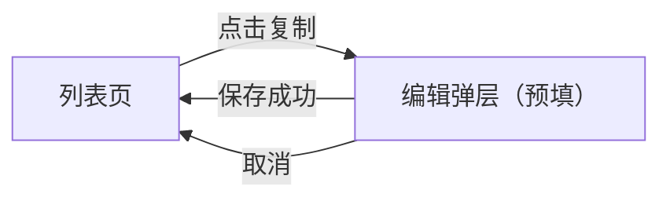

# DEMO-001 原型交互澄清文档（Stage 2）

## §0 元信息 + 范围对账

| 项 | 内容 |
|---|---|
| 需求 ID / 轮次 | DEMO-001 / v1 |
| 产线 | admin |
| 终端 | PC |
| 产品壳来源 | 样例用脚手架内的简化弹层；接真实壳见 adapters/PRODUCT.md |

**范围对账**：

| PRD 一期功能点 | 本期是否做 | 原型呈现 | 冲突处理 |
|---|---|---|---|
| 操作列增加复制 | 做 | 01 帧按钮 + 弹层预填 | 无冲突 |
| 批量复制 | 不做 | — | 收窄，不画 |

## §1 信息层级与页面流

列表页操作列 → 复制 → 编辑弹层（预填）→ 保存回列表 / 取消关闭。

## §2 全局交互规则

主按钮「保存」在左，取消在右。保存中按钮置灰，失败 toast「保存失败，请重试」。

## §3 全量文案表

| 编号 | 位置 | 文案 | 来源 |
|---|---|---|---|
| T-01 | 操作列 | 复制 | PRD §1 |
| T-02 | 弹层标题 | 复制条目 | PRD §1 |
| T-03 | 名称默认 | 原名称 + 副本 | 用户拍板 |

## §4 微决策清单（五件套）

### 列表 / 编辑弹层

| 控件 | ①文案 | ②位置 | ③视觉层级 | ④状态 | ⑤点击去向 | 来源 |
|---|---|---|---|---|---|---|
| 复制 | T-01 | 操作列，编辑之后 | 次按钮 | 可点 | 打开弹层并预填 | PRD §1 |
| 保存 | 保存 | 弹层底部左侧 | 主按钮 | 默认可点 / 保存中置灰 | 成功关弹层并刷新列表 | 现有编辑弹层 |
| 取消 | 取消 | 保存右侧 | 次按钮 | 可点 | 关闭不保存 | 现有编辑弹层 |

形态：沿用现有编辑弹层，已对照线上编辑弹层。

## §5 一致性单源

| 对象 | 唯一定义 | 出现帧 |
|---|---|---|
| 编辑弹层 | 标题 + 名称 + 底栏保存/取消 | 01 |

## §6 交互完整性自检

- [x] 每个可点元素有去向
- [x] 保存中、失败有进入和退出
- [x] 主流程闭环
- [x] 空列表不出现复制

## §7 待审清单

| # | 决策点 | AI 默认 | 理由 | 待用户 |
|---|---|---|---|---|
| 1 | 无 | — | 名称后缀已由用户拍板 | — |

## §8 角色×状态

N/A，无多角色可见性差异。

## §9 变更回流账

| 日期 | 用户改动要点 | 澄清已更（§） | 是否回流 PRD |
|---|---|---|---|
| — | 本批无中途改动 | — | — |

## 澄清闸

- [x] §0～§4 已填
- [x] **用户已确认澄清**：名称就加「副本」，按这个画（样例用户原话）
